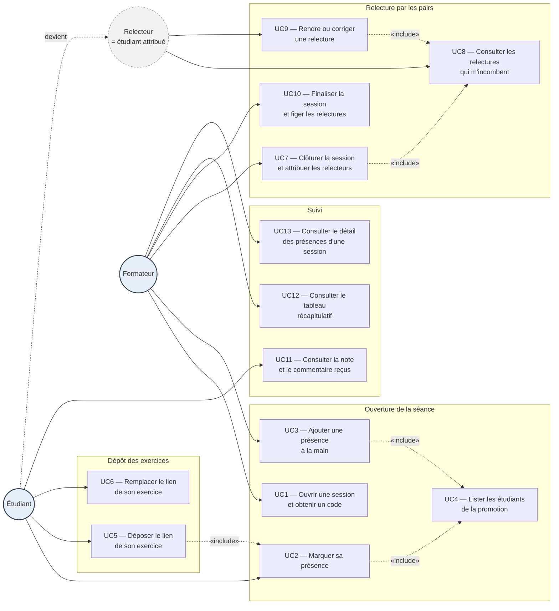

# D1 — Diagramme de cas d'utilisation

Mermaid n'offre pas de diagramme de cas d'utilisation natif. Le formalisme UML est
rendu par un graphe orienté : les acteurs à gauche et à droite, les cas d'utilisation
groupés par phase du cycle de vie d'une session, les relations `<<include>>` en
pointillés.

Conforme à la section 2 du cahier des charges : le **relecteur n'est pas un acteur
distinct**, c'est un étudiant à qui une relecture a été attribuée. Il figure donc en
acteur grisé, dérivé de l'étudiant.

## Lecture

| Relation | Sens |
|---|---|
| `UC2 «include» UC4` | On ne peut pas marquer sa présence sans avoir choisi son nom dans la liste de la promotion — conséquence directe de `Q1` |
| `UC5 «include» UC2` | Le dépôt exige une présence enregistrée (`RG8`, arbitrage du trou n°3) |
| `UC7 «include» UC8` | L'attribution crée les relectures : avant la clôture, aucun relecteur n'a rien à consulter (`RG13`) |
| `Étudiant ⇢ Relecteur` | Dérivation, pas héritage : le rôle naît d'une ligne dans `relecture`, il n'est porté par aucun état de l'étudiant |

**Exigences couvertes :** `EF1` (UC1), `EF2` (UC2, UC4), `EF4` (UC3), `EF5` (UC5), `EF6` (UC6), `EF7` (UC7), `EF8` (UC8), `EF9` (UC9), `EF10` (UC10), `EF11` (UC11), `EF12` (UC12, UC13).
