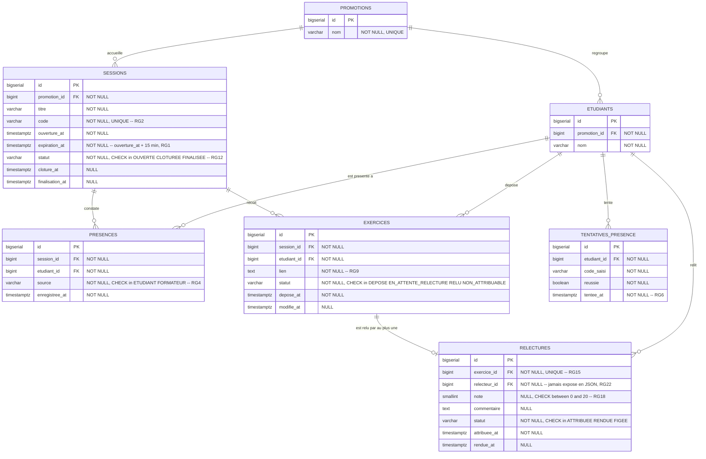

# D2 — Modèle de données

Les tables, colonnes et contraintes sont nommées **telles qu'elles seront créées par les
migrations Flyway** : `snake_case`, pluriel pour les tables, suffixe `_id` pour les clés
étrangères, `_at` pour les horodatages. Le diagramme et `backend/src/main/resources/db/migration/`
doivent rester identiques — c'est un critère noté.

## Contraintes qui portent une règle de gestion

Une règle d'unicité absente d'ici sera absente de la migration. Chacune est donc nommée.

| Contrainte | Table | Définition | Règle |
|---|---|---|---|
| `uq_sessions_code` | `sessions` | `UNIQUE (code)` | `RG2` — le code identifie la session à lui seul |
| `uq_presences_session_etudiant` | `presences` | `UNIQUE (session_id, etudiant_id)` | `RG3` — une présence par étudiant et par session, source du `409 DEJA_PRESENT` |
| `uq_exercices_session_etudiant` | `exercices` | `UNIQUE (session_id, etudiant_id)` | `RG7` — un exercice par étudiant et par session, source du `409 EXERCICE_DEJA_DEPOSE` |
| `uq_relectures_exercice` | `relectures` | `UNIQUE (exercice_id)` | `RG15` — un exercice reçoit au plus un relecteur |
| `uq_relectures_session_relecteur` | `relectures` | `UNIQUE (exercice_id, relecteur_id)` renforcé applicativement par session | `RG16` — un étudiant relit au plus un exercice par session |
| `ck_relectures_note` | `relectures` | `CHECK (note IS NULL OR note BETWEEN 0 AND 20)` | `RG18` — note entière de 0 à 20 |
| `ck_sessions_statut` | `sessions` | `CHECK (statut IN ('OUVERTE','CLOTUREE','FINALISEE'))` | `RG12` — les trois états, sans retour en arrière |
| `ck_presences_source` | `presences` | `CHECK (source IN ('ETUDIANT','FORMATEUR'))` | `RG4` — traçabilité de l'ajout manuel |
| *applicative* | `relectures` | `relecteur_id <> (SELECT etudiant_id FROM exercices WHERE id = exercice_id)` | `RG19` — jamais relire son propre exercice, vérifiée au service et couverte par un test unitaire |

## Index

| Index | Motif |
|---|---|
| `idx_presences_session` sur `presences(session_id)` | Vivier des présents au moment du tirage (`RG14`) |
| `idx_exercices_session` sur `exercices(session_id)` | Exercices à attribuer à la clôture |
| `idx_relectures_relecteur` sur `relectures(relecteur_id)` | Liste des relectures dues à un étudiant (`EF8`, `Q16`) |
| `idx_tentatives_etudiant_date` sur `tentatives_presence(etudiant_id, tentee_at DESC)` | Cinq dernières tentatives d'un étudiant (`RG6`) |
| `idx_etudiants_promotion` sur `etudiants(promotion_id)` | Tableau récapitulatif en une requête, exigé par `ENF2` |

## Choix expliqués

- **Pas de table `relecteur`.** Le rôle naît de `relectures.relecteur_id`, conformément à la section 2 du cahier des charges. L'anonymat de `Q8` est alors tenu par le format de réponse : `relecteur_id` n'est exposé par aucun DTO destiné à l'auteur.
- **`note` et `commentaire` sont nullables.** Une relecture existe dès l'attribution, avant d'être rendue : c'est cet état `ATTRIBUEE` qui matérialise l'attente visible du formateur exigée par `Q11` et `RG23`.
- **Le statut de l'exercice est dérivé mais stocké.** `EN_ATTENTE_RELECTURE`, `RELU` et `NON_ATTRIBUABLE` pourraient se calculer, mais `NON_ATTRIBUABLE` n'est pas déductible après coup — l'absence de relecteur éligible est un fait daté de la clôture (`RG17`).
- **`tentatives_presence` est une table à part.** Compter les échecs récents suppose de les conserver ; un compteur sur `etudiants` ne permettrait pas la remise à zéro par fenêtre glissante de `RG6`, ni un test reproductible.
- **`timestamptz` partout.** L'expiration à quinze minutes (`RG1`) doit être insensible au fuseau du serveur.

**Correspondance migrations :** `backend/src/main/resources/db/migration/` — `V1__schema_initial.sql` crée les sept tables, les contraintes et les index ci-dessus ; `V2__donnees_demonstration.sql` charge le jeu de démonstration, séparé du schéma.
