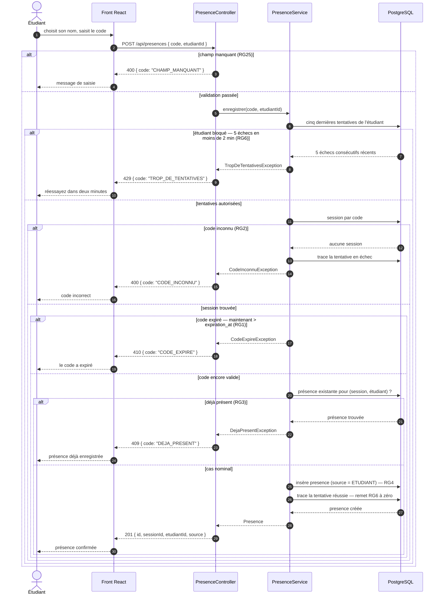

# D3 — Séquence : marquer sa présence

Cas nominal et quatre cas d'erreur. **Les codes HTTP et les identifiants d'erreur sont
ceux du contrat `api/contrat.yaml`, à la lettre** — `201`, `400 CODE_INCONNU`,
`409 DEJA_PRESENT`, `410 CODE_EXPIRE` — augmentés du `429 TROP_DE_TENTATIVES` ajouté
pour porter `RG6`, décision justifiée en section 7 du cahier des charges.

Toute réponse d'erreur porte le corps imposé `{ code, message }` (`RG25`).

## Correspondance avec le contrat

| Branche | Statut | Code stable | Règle | Au contrat |
|---|---|---|---|---|
| Cas nominal | `201` | — | `RG3`, `RG4` | imposé |
| Champ absent du corps | `400` | `CHAMP_MANQUANT` | `RG25` | imposé |
| Code ne correspondant à aucune session | `400` | `CODE_INCONNU` | `RG2` | imposé |
| Présence déjà enregistrée | `409` | `DEJA_PRESENT` | `RG3` | imposé |
| Code dont la durée de vie est écoulée | `410` | `CODE_EXPIRE` | `RG1` | imposé |
| Étudiant bloqué après cinq échecs | `429` | `TROP_DE_TENTATIVES` | `RG6` | **ajouté** — voir §7 |

## Points de vigilance pour l'implémentation

- **L'ordre des contrôles est signifiant.** Le blocage (`RG6`) précède la recherche de la session : un étudiant bloqué ne doit pas pouvoir apprendre, par la différence entre `400` et `410`, qu'un code existe. C'est la raison d'être de `Q4`.
- **L'expiration se teste avant l'unicité.** Un code expiré renvoie `410`, même si l'étudiant était déjà présent : l'information la plus utile est que le code ne vaut plus rien.
- **Seuls les échecs sont tracés comme tels.** Une tentative réussie remet le compteur à zéro (`RG6`), ce qui se traduit par une ligne `reussie = true` dans `tentatives_presence`.
- **La présence ajoutée par le formateur ne passe pas par ce chemin.** Elle emprunte l'opération de présence manuelle, sans code et sans contrôle d'expiration (`RG5`), et écrit `source = FORMATEUR`.

**Règles de gestion illustrées :** `RG1`, `RG2`, `RG3`, `RG4`, `RG6`, `RG25`.
