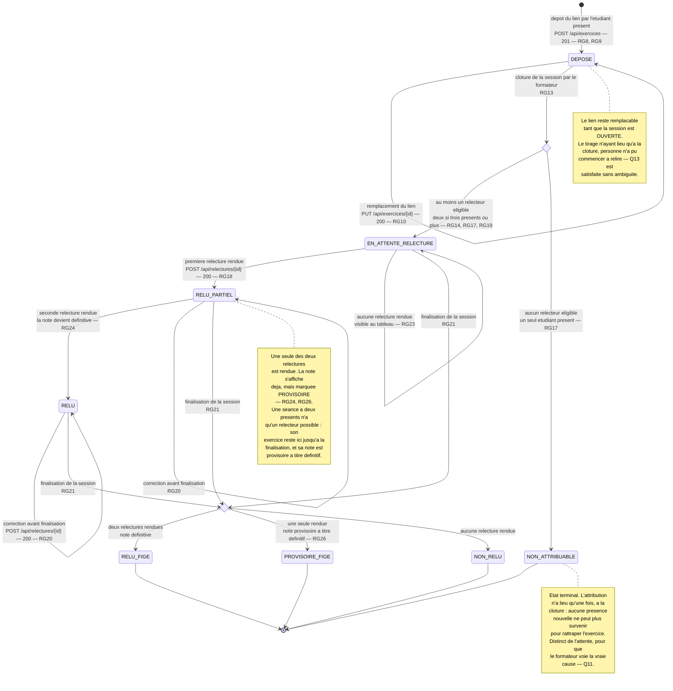

# D4 — États-transitions : cycle de vie d'un exercice

Diagramme bonus. Chaque transition porte **l'événement qui la déclenche** et la règle
de gestion qui la gouverne. Les états correspondent exactement aux valeurs admises par
la contrainte `ck_exercices_statut` de `D2` et au champ `statut` renvoyé par
`POST /api/exercices`.

## Les états

| État | Ce qu'il signifie | Statut renvoyé par l'API |
|---|---|---|
| `DEPOSE` | Le lien est enregistré, la session est encore ouverte, le lien reste remplaçable | `DEPOSE` |
| `EN_ATTENTE_RELECTURE` | Un relecteur a été tiré au sort, il n'a pas encore rendu. C'est l'attente que `Q11` exige de rendre visible | `EN_ATTENTE_RELECTURE` |
| `RELU_PARTIEL` | **Une seule** des deux relectures est rendue. La note s'affiche déjà, marquée **provisoire** (`RG24`, `RG26`) | `RELU_PARTIEL` |
| `RELU` | **Les deux** relectures sont rendues. La note est la moyenne des deux, et elle est définitive (`RG24`) | `RELU` |
| `NON_ATTRIBUABLE` | À la clôture, aucun étudiant présent autre que l'auteur n'était disponible. **État terminal** (`RG17`) | `NON_ATTRIBUABLE` |
| `RELU_FIGE` · `PROVISOIRE_FIGE` · `NON_RELU` | États post-finalisation. Ils ne sont pas stockés dans `exercices.statut` : ils résultent de la combinaison du statut de l'exercice et de `sessions.statut = FINALISEE`. Le tableau du formateur les distingue | dérivé |

## Ce que le diagramme rend explicite

- **Aucune transition ne revient en arrière.** Un exercice ne redevient jamais `DEPOSE` après la clôture : c'est la traduction de `RG12` au niveau de l'exercice.
- **La boucle sur `DEPOSE`** matérialise `RG10` : le remplacement du lien est libre tant que la session est ouverte, et cette liberté cesse d'un coup à la clôture.
- **Le passage par `RELU_PARTIEL`** matérialise le changement de l'étape 3 : entre « personne n'a rendu » et « tout est rendu », il existe désormais un état intermédiaire où la note existe mais n'est pas définitive. C'est exactement ce que le client a demandé — « on affiche sa note en attendant, mais marquée comme provisoire ».
- **`PROVISOIRE_FIGE` n'est pas un échec.** Une séance à deux présents ne peut désigner qu'un relecteur (`RG17`) : son exercice finit provisoire à titre définitif. Le formateur doit pouvoir le distinguer d'une relecture simplement en retard.
- **Les boucles sur `RELU_PARTIEL` et `RELU`** matérialisent `RG20` : la relecture est corrigible après avoir été rendue. C'est l'arbitrage `Q10` contre `Q15`, lisible sur le diagramme.
- **La boucle sur `EN_ATTENTE_RELECTURE`** n'est pas un artefact : elle représente le relecteur qui ne rend jamais rien (`Q11`, `RG23`). L'exercice n'évolue pas, mais le formateur doit le voir.
- **Les deux nœuds de choix** correspondent aux deux actes du formateur. Ce sont les seuls moments où le système décide quelque chose de lui-même.

**Règles de gestion illustrées :** `RG8`, `RG9`, `RG10`, `RG13`, `RG14`, `RG17`, `RG18`, `RG19`, `RG20`, `RG21`, `RG23`, `RG24`, `RG26`.
